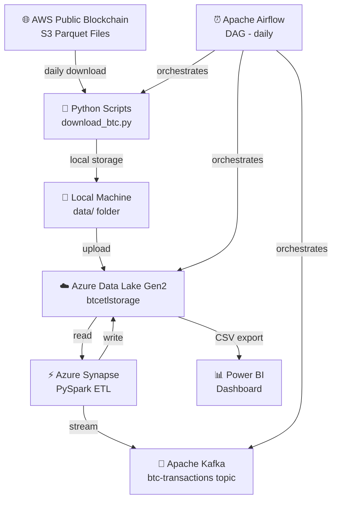
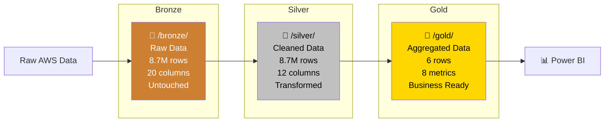
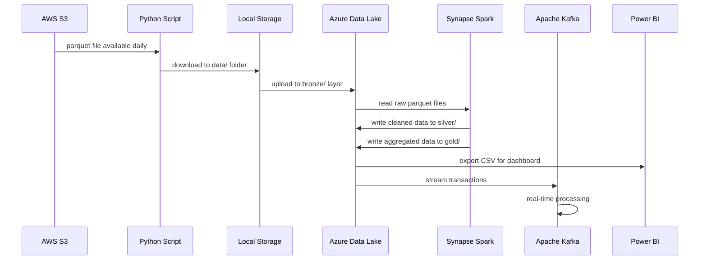
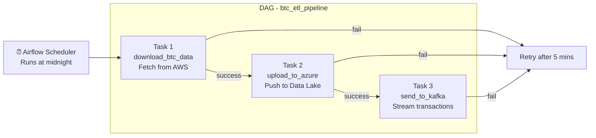
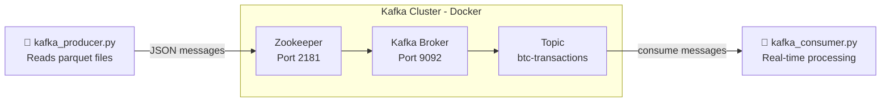
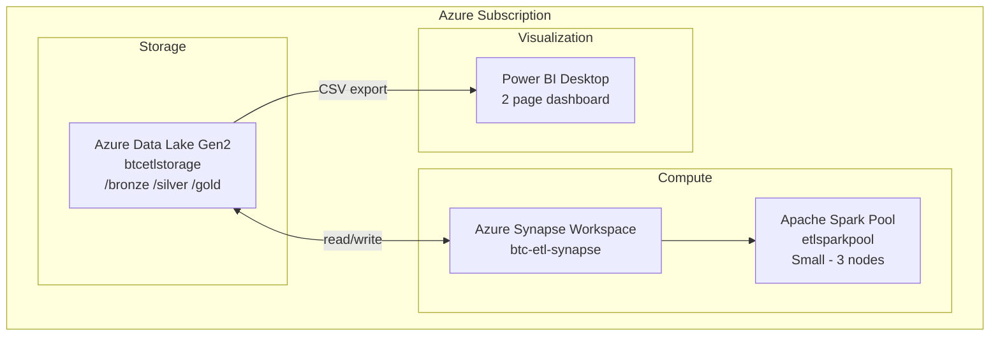
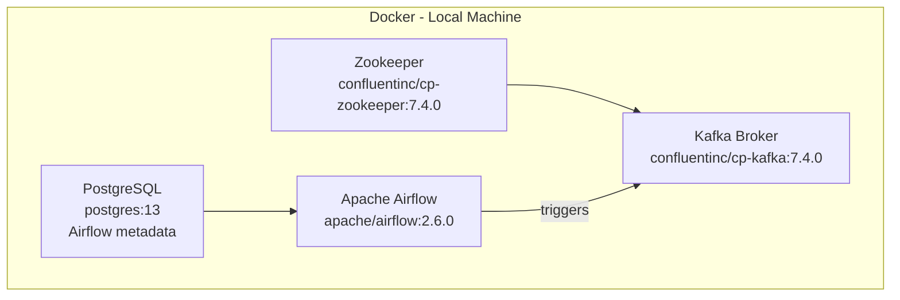
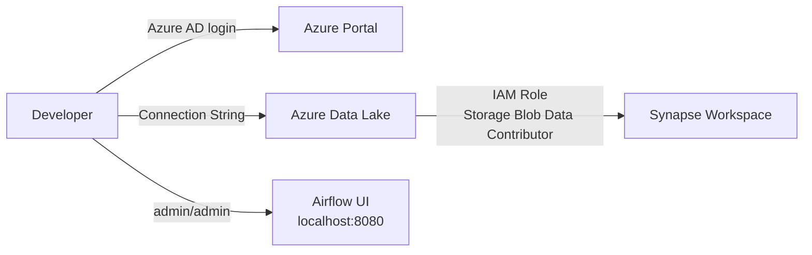
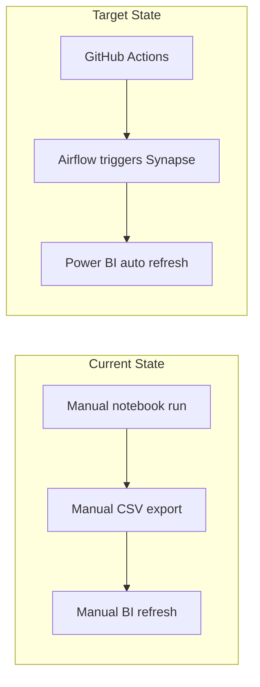
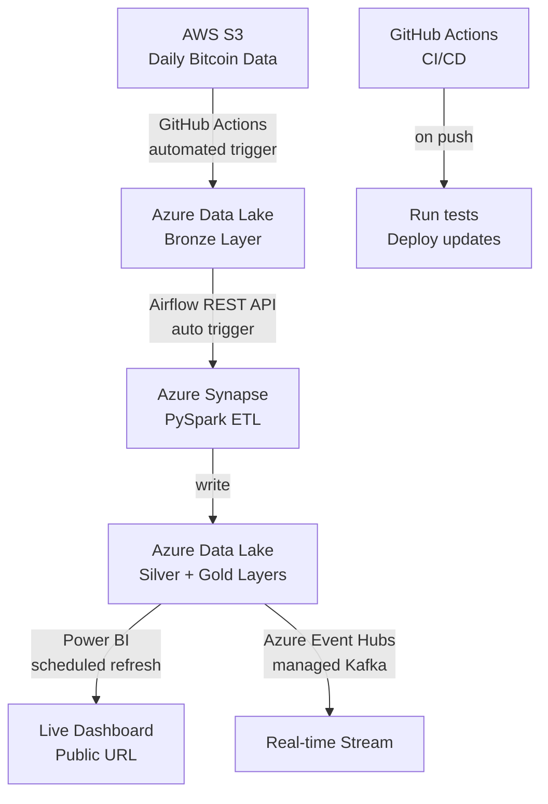

# Architecture Document — Bitcoin Blockchain ETL Pipeline

---

## 1. Overview

This document describes the high-level architecture of the Bitcoin
Blockchain ETL Pipeline. It shows how every component fits together,
how data moves through the system, and why each piece was chosen.

The goal was simple — build a pipeline that:
- collects real Bitcoin data automatically every day
- cleans and organizes it in the cloud
- makes it easy to analyze and visualize

---

## 2. High Level Architecture

---

## 3. Medallion Architecture

The data is organized into three layers inside Azure Data Lake.
This is called Medallion Architecture — an industry standard
pattern used by companies like Databricks and Microsoft.

### What each layer contains:

| Layer | Folder | Rows | Columns | Purpose |
|-------|--------|------|---------|---------|
| 🥉 Bronze | `/bronze/` | 8,781,456 | 20 | Raw data — never modified |
| 🥈 Silver | `/silver/` | 8,772,036 | 12 | Cleaned + feature engineered |
| 🥇 Gold | `/gold/` | 6 | 8 | Aggregated yearly insights |

---

## 4. Data Pipeline Flow

This shows exactly how data moves from source to dashboard,
step by step.

---

## 5. Airflow DAG Architecture

Apache Airflow automates the pipeline. The DAG runs every day
at midnight without any manual intervention.

**DAG Configuration:**
- **Schedule:** `@daily` (every midnight)
- **Retries:** 1 retry per task
- **Retry delay:** 5 minutes
- **Start date:** January 1, 2026

---

## 6. Kafka Streaming Architecture

Apache Kafka handles real-time streaming of Bitcoin transactions.

**Kafka Configuration:**
- **Broker:** `localhost:9092`
- **Topic:** `btc-transactions`
- **Zookeeper:** `localhost:2181`
- **Image:** `confluentinc/cp-kafka:7.4.0`
- **Message format:** JSON

---

## 7. Azure Infrastructure

All cloud resources live under one Azure subscription.

**Azure Resources:**

| Resource | Name | Type | Region |
|----------|------|------|--------|
| Storage Account | `btcetlstorage` | ADLS Gen2 | East US |
| Synapse Workspace | `btc-etl-synapse` | Analytics | East US |
| Spark Pool | `etlsparkpool` | Apache Spark | East US |

---

## 8. Local Infrastructure

Some components run locally on the developer's machine using Docker.

**Docker Compose Files:**
- `docker-compose.yml` → Kafka + Zookeeper only
- `docker-compose-v2.yml` → Kafka + Zookeeper + Airflow + PostgreSQL

---

## 9. Security Architecture

**Security Notes:**
- Azure connection strings are stored locally — never committed to GitHub
- Airflow runs locally — not exposed to internet
- Azure IAM role grants Synapse access to Data Lake
- All credentials replaced with placeholders in public code

---

## 10. Deployment Architecture

Current state vs target state:

### Current State:
- Data ingestion → automated via Airflow ✅
- Synapse ETL → manual (run notebook) ❌
- Power BI refresh → manual ❌

### Target State:
- Data ingestion → automated via Airflow ✅
- Synapse ETL → triggered via REST API from Airflow ❌
- Power BI refresh → scheduled via API ❌
- GitHub Actions → auto data pulls on push ❌

---

## 11. Technology Choices

| Tool | Alternative Considered | Why We Chose This |
|------|----------------------|-------------------|
| Azure Synapse | Databricks | Free with student credits |
| Apache Kafka | Azure Event Hubs | Free via Docker locally |
| Apache Airflow | Azure Data Factory | More control, open source |
| Power BI | Tableau | Microsoft ecosystem, free desktop |
| Parquet | CSV | Faster reads, smaller file size |
| Docker | Manual install | Portable, consistent environment |

---

## 12. Future Architecture

When fully deployed, the architecture will look like this:

