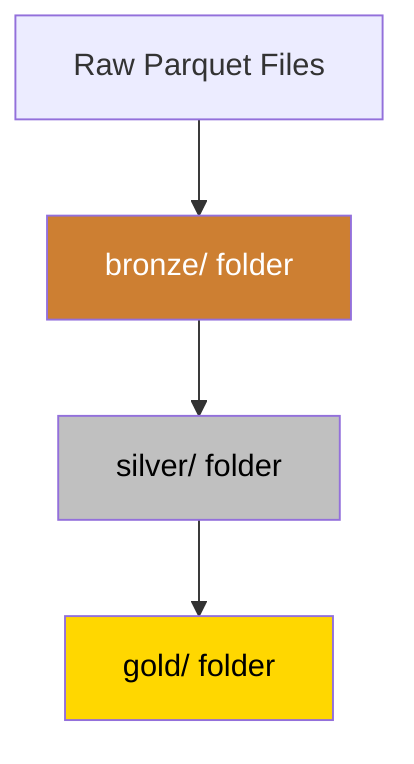
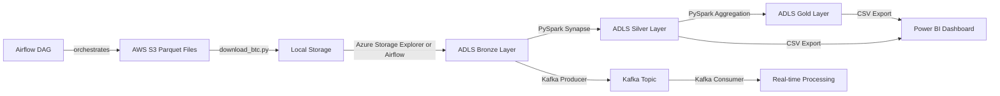

# Technical Design Document
## Bitcoin Blockchain ETL Pipeline

---

## 1. Overview

This document explains how the Bitcoin Blockchain ETL Pipeline 
works under the hood. It covers every component, how data moves 
through the system, and the decisions made along the way.

The pipeline was built to answer one question:

> When were Bitcoin fees lowest — and what caused them to spike?

To answer that, we needed to collect, clean, store, and visualize 
8.7 million real Bitcoin transactions spanning 5 years.

---

## 2. System Components

### 2.1 Data Source — AWS Public Blockchain
- **What it is:** Amazon Web Services hosts a free public dataset 
  of the entire Bitcoin blockchain
- **Format:** Parquet files (one file per day)
- **Location:** `s3://aws-public-blockchain/v1.0/btc/transactions/`
- **Update frequency:** Daily
- **Why we chose it:** Free, reliable, real data — no API keys needed

### 2.2 Python Download Scripts
- **What it does:** Downloads parquet files from AWS to local storage
- **Key script:** `download_btc.py`
- **Logic:** Lists files in S3 bucket via XML API → finds parquet 
  file for each date → downloads with retry logic (5 attempts)
- **Why retry logic:** Network failures happen. Retry logic makes 
  the script resilient without manual intervention

### 2.3 Azure Data Lake Storage Gen2 (ADLS)
- **What it is:** Microsoft's cloud storage for big data
- **Storage account:** `btcetlstorage`
- **Container:** `btc-transactions`
- **Why ADLS Gen2:** Supports hierarchical namespace (folders), 
  integrates natively with Synapse, scales to petabytes
- **Structure (Medallion Architecture):**



| Layer | Path | Description | Rows |
|-------|------|-------------|------|
| Bronze | `/bronze/` | Raw data, untouched | 8,781,456 |
| Silver | `/silver/` | Cleaned + transformed | 8,772,036 |
| Gold | `/gold/` | Aggregated by year | 6 |

### 2.4 Azure Synapse Analytics
- **What it is:** Cloud compute engine for big data processing
- **Spark pool:** `etlsparkpool` (Small, 3 nodes, Memory Optimized)
- **Language:** PySpark (Python)
- **Why Synapse:** Integrates directly with ADLS, scales on demand,
  auto-pauses when idle (saves cost)
- **Auto-pause:** 15 minutes idle → pool pauses automatically

### 2.5 Apache Kafka
- **What it is:** Real-time message streaming platform
- **Setup:** Docker container (confluent/cp-kafka:7.4.0)
- **Topic:** `btc-transactions`
- **Producer:** reads parquet files → sends each row as JSON message
- **Consumer:** receives messages → processes in real time
- **Why Kafka:** Simulates production streaming pipeline used by 
  companies like Uber and Netflix

### 2.6 Apache Airflow
- **What it is:** Workflow scheduler and automation tool
- **Setup:** Docker container (apache/airflow:2.6.0)
- **DAG:** `btc_etl_pipeline`
- **Schedule:** `@daily` (runs every midnight automatically)
- **Tasks:**
  1. `download_btc_data` → fetch today's file from AWS
  2. `upload_to_azure` → push file to Data Lake
  3. `send_to_kafka` → stream transactions

### 2.7 Power BI
- **What it is:** Microsoft's data visualization tool
- **Data source:** CSV exported from Silver layer
- **Pages:** 2 dashboards
  - Page 1: Raw transaction analysis
  - Page 2: Gold layer aggregated insights
- **Refresh:** Manual (student account limitation)

---

## 3. Data Flow



---

## 4. Data Schema

### 4.1 Raw Schema (Bronze Layer)
| Column | Type | Description |
|--------|------|-------------|
| txid | string | Unique transaction ID |
| hash | string | Transaction hash |
| version | long | Bitcoin protocol version |
| size | long | Transaction size in bytes |
| block_hash | string | Hash of the block |
| block_number | long | Block number in chain |
| input_count | long | Number of senders |
| output_count | long | Number of receivers |
| is_coinbase | boolean | Mining reward flag |
| output_value | double | BTC amount sent |
| input_value | double | BTC amount received |
| fee | double | Transaction fee paid |
| block_timestamp | timestamp | When transaction occurred |
| date | date | Date partition |

### 4.2 Transformed Schema (Silver Layer)
All columns from Bronze PLUS:

| Column | Type | Description | Formula |
|--------|------|-------------|---------|
| fee_percentage | double | Fee as % of input | (fee/input_value) × 100 |
| complexity_ratio | double | Outputs per input | output_count/input_count |
| btc_value_category | string | Transaction size label | whale/large/medium/small |

### 4.3 Aggregated Schema (Gold Layer)
| Column | Type | Description |
|--------|------|-------------|
| year | integer | Year of transactions |
| total_transactions | long | Count of transactions |
| avg_output_value | double | Average BTC per transaction |
| total_output_value | double | Total BTC moved |
| avg_fee_percentage | double | Average fee % |
| avg_complexity_ratio | double | Average complexity |
| max_transaction_value | double | Largest single transaction |
| min_transaction_value | double | Smallest single transaction |

---

## 5. Feature Engineering

Three new columns were created from existing data:

### fee_percentage
```python
fee_percentage = (fee / input_value) * 100
```
**Why:** Raw fee amounts are hard to compare across transactions 
of different sizes. Expressing fee as a percentage makes it 
comparable — a 0.001 BTC fee means very different things on a 
0.01 BTC transaction vs a 10 BTC transaction.

### complexity_ratio
```python
complexity_ratio = output_count / input_count
```
**Why:** Identifies transaction complexity. A ratio of 1.0 means 
simple (one sender, one receiver). A ratio of 100 means one sender 
paying 100 people — like a company running payroll.

### btc_value_category
```python
if output_value > 50  → "whale"
if output_value > 10  → "large"
if output_value > 1   → "medium"
else                  → "small"
```
**Why:** Raw numbers are hard to interpret quickly. Categories 
allow instant pattern recognition — what % of transactions are 
whales vs retail users?

---

## 6. Statistical Analysis

Five statistical tests were run on the Silver layer:

| Test | Method | Key Finding |
|------|--------|-------------|
| Descriptive Stats | `.describe()` | Max transaction: 92,114 BTC |
| Correlation | `.stat.corr()` | Fees NOT correlated with value (0.01) |
| YoY Growth | `pct_change()` | 2015 had highest growth at 84% |
| Fee Trends | `groupBy().agg()` | 2017 fees 3x higher than 2016 |
| Whale Activity | `count(when())` | Whales dropped from 5.54% to 2.71% |

---

## 7. Error Handling

| Component | Potential Error | Handling Strategy |
|-----------|----------------|-------------------|
| Download script | Network timeout | Retry 5 times with 10s delay |
| Corrupted files | Bad parquet magic | `check_files.py` removes bad files |
| Missing columns | Schema mismatch | Use `btc_*.parquet` glob pattern |
| Airflow task fail | API error | Retry once after 5 minutes |
| Spark session | Timeout/capacity | Re-run all cells from scratch |

---

## 8. Performance

| Operation | Time | Notes |
|-----------|------|-------|
| Download 59 files | 30-45 mins | Depends on internet speed |
| Azure upload | 20-30 mins | 59 large files |
| Synapse ETL (8.7M rows) | ~3 mins | 3-node Spark cluster |
| Airflow daily run | ~52 seconds | Download + upload only |
| Power BI load | ~2 mins | 526k row CSV sample |

---

## 9. Cost & Infrastructure

| Resource | Config | Estimated Cost |
|----------|--------|----------------|
| Azure Data Lake | LRS, Standard | ~$2/month |
| Synapse Spark Pool | Small, 3 nodes, auto-pause | ~$5/month |
| Docker (local) | Kafka + Airflow | Free |
| Power BI Desktop | Student license | Free |
| **Total** | | **~$7/month** |

**Note:** Running on Azure Student Credits (CA$103 remaining) — 
approximately 6 months of free usage.

---

## 10. Known Limitations

1. **Kafka-Airflow connection** — Kafka runs in Docker locally. 
   Airflow container cannot reach it due to Docker networking. 
   Solution: migrate to Azure Event Hubs (managed Kafka).

2. **Power BI manual refresh** — scheduled refresh requires 
   Power BI Pro subscription. Current workaround is manual refresh 
   after each Synapse run.

3. **Synapse session timeout** — Spark session expires after 
   15 minutes idle. All cells must be re-run after timeout.

4. **Student account limitations** — some Azure features 
   (dedicated SQL pools, larger Spark nodes) require paid subscription.

---

## 11. Future Improvements

- Migrate Kafka to Azure Event Hubs
- Connect Airflow to trigger Synapse via REST API
- Add GitHub Actions for automated data pulls
- Add data quality checks before Bronze layer write
- Add alerting when pipeline fails
- Power BI scheduled refresh via API workaround
- Deploy dashboard publicly on a website
